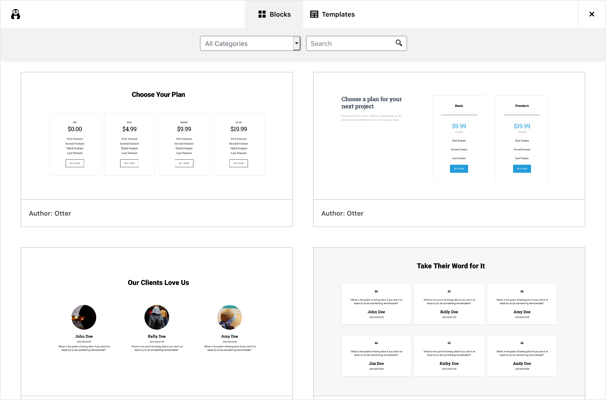

# Template Library

Template Library a part of Section block in which allows users to import pre-built section and page templates with one-click import.



It has two Tabs:

- Blocks
- Templates

**Blocks** contain pre-built sections, such as Pricing, Services of Header, while **Templates** contain full-page templates, such as a Homepage or an About page.

## Adding New Templates

The process of adding new templates to the Template Library is reasonably straightforward.

1. You need to create your block or page template in Gutenberg as you would typically make any layout.

	Make sure you test to check it is responsive and works just fine on all devices.

2. Once your template is ready, you need to export it to JSON using [Blocks Export Import plugin](https://wordpress.org/plugins/blocks-export-import/).

3. Once you have your JSON file, you need to make sure of two things:

	- Remove all the occurrences of `"id": "wp-block-themeisle-blocks-...",` from your JSON file.

		Some of the blocks generate front-end CSS using a unique ID, so you need to make sure the IDs are generated client-site and are not added to the templates.

		You can either remove all the IDs manually, or you can run the following regex in search are replace on editors such as VS Code.

		`\n(.*)"id": "wp-block-themeisle-blocks-(.*)"`

	- Replace links to all the images used in the layout, if any, with links to remote images.

		If your template is an official template then you can upload or use pre-uploaded images from: [gutenberg-templates/tree/master/assets/images](https://github.com/Codeinwp/gutenberg-templates/tree/master/assets/images)

		If the images are coming from a plugin, theme or any third-party resource, you can keep the image in your plugin/theme's assets.

4. Take a screenshot of your section for the display. It is recommended to use your browser's development tools to take a picture of the parent node to get the best output.

5. Once your assets are ready, you can upload them to the [gutenberg-templates](https://github.com/Codeinwp/gutenberg-templates) repository by creating a new folder. The files should be called **template.json** and **screenshot.png**.

	This step is for when you are making the template to be included in the core of Template Library. If you are adding it from a theme or plugin, see the next section.

6. In the end, you can add your template to **$template_list** array in [class-advanced-columns-server.php](https://github.com/Codeinwp/gutenberg-blocks/blob/master/blocks/advanced-columns/class-advanced-columns-server.php) file. It will look something like this:

	- name: Template Name
	- type: Decided in which tab this template it will appear. It can be either `block` or `template`.
	- keywords: Keywords that can be used to search.
	- categories: Categories that can be used for sorting.
	- template_url: Link to template's JSON file.
	- screenshot_url: Link to screenshot of the template for preview.

```
$templates_list = array(
	...
	array(
		'title'			=> __( 'Example Header Block', 'textdomain' ),
		'type'			=> 'block',
		'keywords'		=> array( 'example', 'header' ),
		'categories'		=> array( 'header' ),
		'template_url'		=> 'template.json',
		'screenshot_url'	=> 'screenshot.png',
	),
);
```

## Adding via Theme or Plugin

Once you have generated JSON and screenshot for your template, you can hook it into Template Library using `themeisle_gutenberg_templates` filter, like this:

```
function plugin_add_new_templates( $templates_list ) {
	$templates = array(
		array(
			'title'			=> __( 'Example Header Block', 'textdomain' ),
			'type'			=> 'block',
			'keywords'		=> array( 'example', 'header' ),
			'categories'		=> array( 'header' ),
			'template_url'		=> 'template.json',
			'screenshot_url'	=> 'screenshot.png',
		),
	);

	$list = array_merge( $templates_list, $templates );

	return $list;
}

add_filter( 'themeisle_gutenberg_templates', 'plugin_add_new_templates' );
```